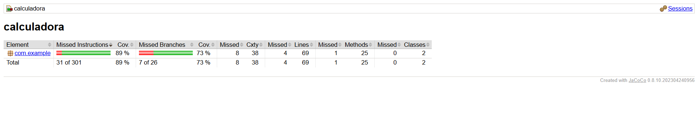
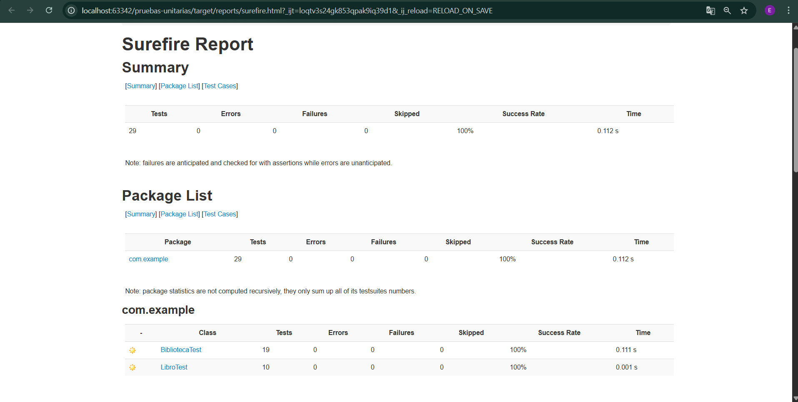
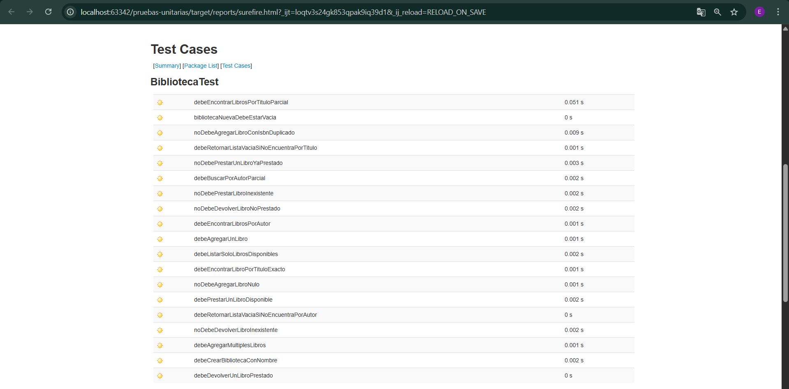
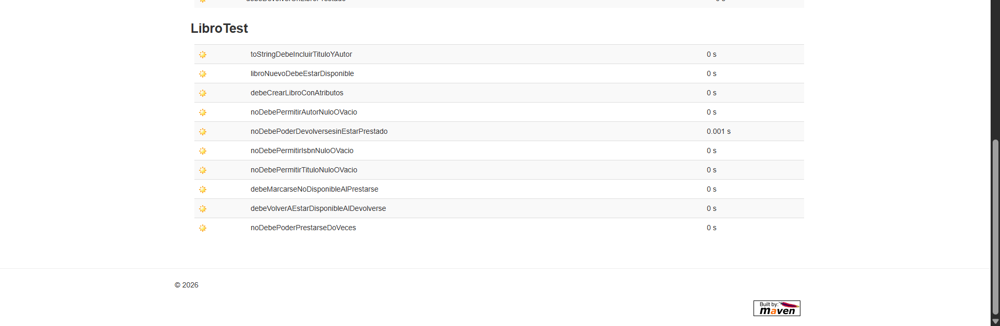

# Documentación TDD — Proyecto Biblioteca

## Descripción

El taller pruebas-unitarias consiste en la implementación de las herramientas de Test Junit y Jacoco
en un proyecto de una biblioteca todo correctamente documentado con Javadoc

## Clase `Libro`

### Requisitos Funcionales

| ID | Requisito | Descripción |
|---|---|---|
| REQ-001 | Crear libro con atributos | El libro debe crearse con título, autor e ISBN válidos |
| REQ-002 | Estado inicial disponible | Un libro recién creado debe estar disponible |
| REQ-003 | Validar campos obligatorios | No debe permitir título, autor o ISBN nulos o vacíos |
| REQ-004 | Prestar libro | El libro debe poder marcarse como no disponible al prestarse |
| REQ-005 | Validar préstamo doble | No debe permitirse prestar un libro ya prestado |
| REQ-006 | Devolver libro | El libro debe volver a estar disponible al devolverse |
| REQ-007 | Validar devolución inválida | No debe permitirse devolver un libro que no está prestado |

### Casos de Prueba

| Requisito | Caso de Prueba | Entrada | Salida Esperada |
|---|---|---|---|
| REQ-001 | TC-001: Crear libro válido | `new Libro("El Quijote", "Cervantes", "ISBN-001")` | Objeto creado con atributos correctos |
| REQ-002 | TC-002: Estado inicial | `new Libro(...)` | `isDisponible()` retorna `true` |
| REQ-003 | TC-003: Título nulo | `new Libro(null, "Autor", "ISBN")` | `IllegalArgumentException` |
| REQ-003 | TC-004: Autor vacío | `new Libro("Título", " ", "ISBN")` | `IllegalArgumentException` |
| REQ-003 | TC-005: ISBN nulo | `new Libro("Título", "Autor", null)` | `IllegalArgumentException` |
| REQ-004 | TC-006: Prestar disponible | `libro.prestar()` | `isDisponible()` retorna `false` |
| REQ-005 | TC-007: Prestar dos veces | `libro.prestar()` → `libro.prestar()` | `IllegalStateException` |
| REQ-006 | TC-008: Devolver prestado | `libro.prestar()` → `libro.devolver()` | `isDisponible()` retorna `true` |
| REQ-007 | TC-009: Devolver sin prestar | `libro.devolver()` | `IllegalStateException` |

---

## Clase `Biblioteca`

### Requisitos Funcionales

| ID | Requisito | Descripción |
|---|---|---|
| REQ-001 | Crear biblioteca | La biblioteca debe crearse con un nombre válido y sin libros |
| REQ-002 | Agregar libro | Debe permitir agregar libros al catálogo |
| REQ-003 | Validar libro nulo | No debe permitir agregar un libro nulo |
| REQ-004 | Validar ISBN duplicado | No debe permitir agregar dos libros con el mismo ISBN |
| REQ-005 | Buscar por título | Debe encontrar libros por título exacto o parcial, sin distinguir mayúsculas |
| REQ-006 | Buscar por autor | Debe encontrar libros por autor exacto o parcial, sin distinguir mayúsculas |
| REQ-007 | Prestar libro | Debe prestar un libro disponible buscándolo por ISBN |
| REQ-008 | Validar préstamo | No debe prestar un libro ya prestado ni uno inexistente |
| REQ-009 | Devolver libro | Debe devolver un libro prestado buscándolo por ISBN |
| REQ-010 | Validar devolución | No debe devolver un libro no prestado ni uno inexistente |

### Casos de Prueba

| Requisito | Caso de Prueba | Entrada | Salida Esperada |
|---|---|---|---|
| REQ-001 | TC-001: Crear biblioteca | `new Biblioteca("Biblioteca Central")` | Nombre correcto, `getTotalLibros()` = 0 |
| REQ-002 | TC-002: Agregar un libro | `biblioteca.agregarLibro(libro1)` | `getTotalLibros()` = 1 |
| REQ-002 | TC-003: Agregar múltiples libros | `agregarLibro(libro1, libro2, libro3)` | `getTotalLibros()` = 3 |
| REQ-003 | TC-004: Agregar nulo | `biblioteca.agregarLibro(null)` | `IllegalArgumentException` |
| REQ-004 | TC-005: ISBN duplicado | Agregar dos libros con `"ISBN-001"` | `IllegalArgumentException` |
| REQ-005 | TC-006: Buscar título exacto | `buscarPorTitulo("Cien años de soledad")` | Lista con 1 resultado correcto |
| REQ-005 | TC-007: Buscar título parcial | `buscarPorTitulo("amor")` | Lista con 1 resultado |
| REQ-005 | TC-008: Título inexistente | `buscarPorTitulo("Libro inexistente")` | Lista vacía |
| REQ-006 | TC-009: Buscar autor completo | `buscarPorAutor("Gabriel García Márquez")` | Lista con 2 resultados |
| REQ-006 | TC-010: Buscar autor parcial | `buscarPorAutor("orwell")` | Lista con 1 resultado |
| REQ-006 | TC-011: Autor inexistente | `buscarPorAutor("Autor Desconocido")` | Lista vacía |
| REQ-007 | TC-012: Prestar disponible | `biblioteca.prestarLibro("ISBN-001")` | Retorna `true`, libro no disponible |
| REQ-008 | TC-013: Prestar ya prestado | Prestar `"ISBN-001"` dos veces | `IllegalStateException` |
| REQ-008 | TC-014: Prestar inexistente | `biblioteca.prestarLibro("ISBN-999")` | `IllegalArgumentException` |
| REQ-009 | TC-015: Devolver prestado | Prestar y devolver `"ISBN-001"` | Retorna `true`, libro disponible |
| REQ-010 | TC-016: Devolver no prestado | `biblioteca.devolverLibro("ISBN-001")` sin prestar | `IllegalStateException` |
| REQ-010 | TC-017: Devolver inexistente | `biblioteca.devolverLibro("ISBN-999")` | `IllegalArgumentException` |

## Jacoco

## Junit

